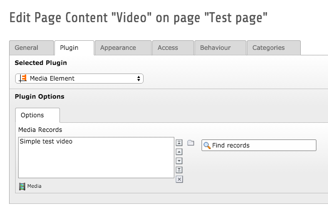
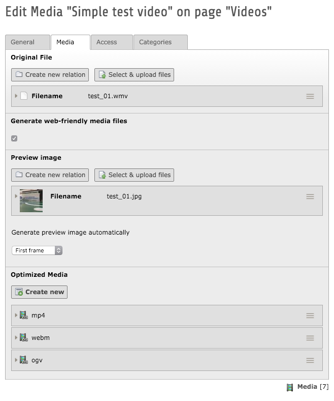
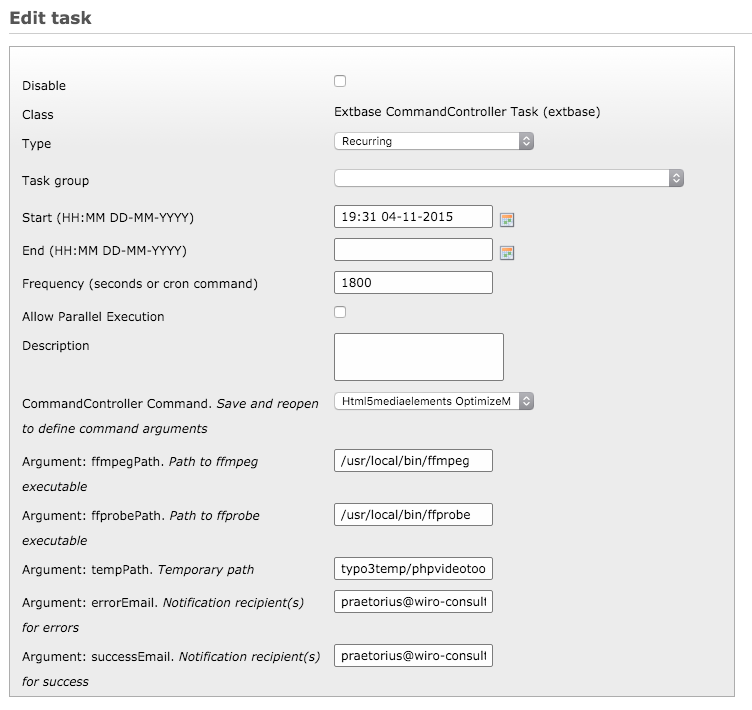

.. ==================================================
.. FOR YOUR INFORMATION
.. --------------------------------------------------
.. -*- coding: utf-8 -*- with BOM.

.. include:: ../Includes.txt

What does it do?
================

The extension provides a user-friendly way of embedding audio and video content into a page. The goal is to make this as easy as possible without relying on external services such as YouTube or Vimeo. The extension can be used both with and without a conversion task that handles different media formats automatically:

Automatic conversion with ffmpeg
--------------------------------

If you want to achieve the best experience for the editor, a working "ffmpeg" environment is recommended on the webserver. With this prerequisite all the editor needs is a media file compatible to your ffmpeg installation. After uploading and referencing the media file, a converter task kicks in and converts the media file to web-friendly formats such as mp4, webm and mp3. The task also creates a poster image for video files based on the original video.

When the conversion has finished, a plugin takes care of embedded the media file into the page using the appropriate HTML5 tags while providing a fallback for older browsers.

Manual conversion
-----------------

While the automatic conversion makes things much easier for the editor, it is possible to use the extension without this feature. In that case the editor should provide at least one web-friendly media format (e. g. mp4 for video, mp3 for audio) manually.

Based on the provided media files the plugin tries to figure out the best way of embedding the media file.

Media plugin
------------

The media plugin is responsible for embedding the provided media in the best way possible. It relies on the popular `MediaElement.js <http://mediaelementjs.com/>`_ media player to show a consistent interfaces in all popular browsers. It prioritizes some file formats based on their browser support and implements a Flash fallback in case HTML5 isn't supported by the browser. As a last resort a plain link to the media file is used.

	Embedding a media file with the plugin

Media records
-------------

All information about a media file, including the file itself as well as its web-friendly versions, are stored in a backend record. Those records can be extended easily by other extensions and can be used to create a playlist functionality in the frontend (not part of this extension – yet!).

	Media record with a wmv file as source, a poster image generated with ffmpeg and three web-friendly versions, also generated with ffmpeg

Conversion task
---------------

All conversions with ffmpeg are handled by a scheduler task that is based on `PHP Video Toolkit version 2 <https://github.com/buggedcom/phpvideotoolkit-v2>`_. The task checks which media records need some kind of conversion (audio/video, poster image) and triggers the appropriate ffmpeg command. Afterwards it adds the newly generated files to FAL and creates references to the media record.

	Configuration of the scheduler task

In case you don't want or can't use ffmpeg on your server, just ignore the scheduler task. The extension will work just fine without it.