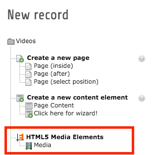
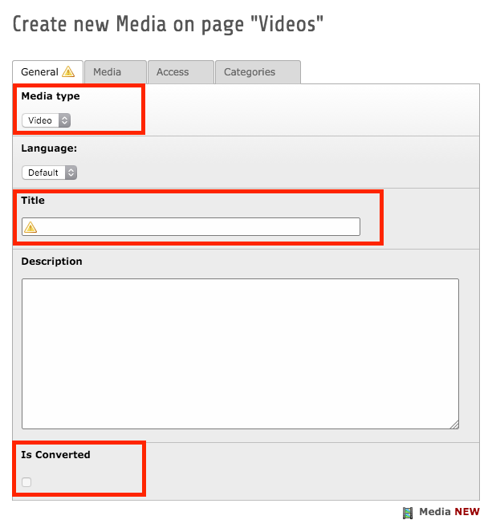
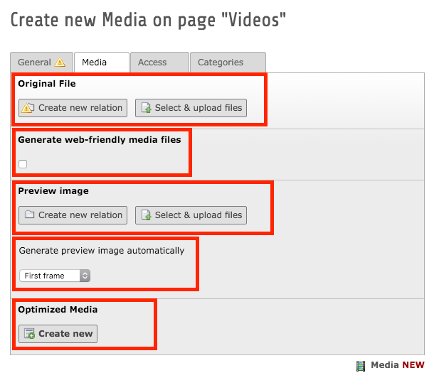
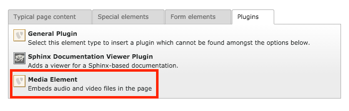
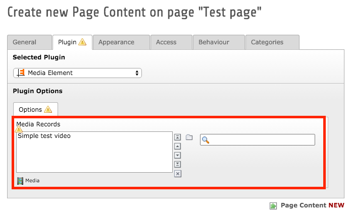

.. ==================================================
.. FOR YOUR INFORMATION
.. --------------------------------------------------
.. -*- coding: utf-8 -*- with BOM.

.. include:: ../Includes.txt

.. _users-manual:

Users manual
============

Adding a media record
---------------------

To be able to embed media into your website, you first have to create a media record. This can be done in the list module:

	Add new media record

After that you have to specify some attributes of the new media record:

- its type, either audio or video
- a title
- the source media file

If you want to use the automatic conversion with ffmpeg, you have to check the checkbox

- Generate web-friendly media files

to trigger the conversion with the next task run. Once the conversion is finished, the read-only checkbox

- Is Converted

will be checked and the record will never be touched (except for poster images) by the conversion again unless that checkbox is unchecked again.

If you don't use ffmpeg you should specify some web-friendly media files manually:

- optimized media files (e. g. 2 video files: mp4 and webm)

Videos should have a preview image that will be shown before the video is loaded. If ffmpeg is available, a preview can be created automatically, but you can specify the image manually as well.

	General attributes

	Media attributes

Embedding the media into a page
-------------------------------

To embed an existing media record into a page, you have to create a new instance of the Media Element plugin on the page. In its plugin settings you can select one or more media record that should be rendered by the plugin.

	Insert Plugin

	Select media records